# Architecture

System design, data flow, and design-decision rationale for the recipe enhancement pipeline.
This describes the system **as it currently exists** (verified by reading the code and re-running
it live on 2026-09-04), not the intended end-state — divergences between what the code does and
what the docs/sample data imply are called out explicitly, since that gap is the main risk area.

## System overview

```mermaid
flowchart LR
    A["scraper_v2.py\n(AllRecipes HTML)"] --> B["data/recipe_*.json\n(recipe + reviews)"]
    B --> C["LLMAnalysisPipeline\n(pipeline.py)"]
    C --> D["1. TweakExtractor\n(tweak_extractor.py)"]
    D -->|"ModificationObject"| E["2. RecipeModifier\n(recipe_modifier.py)"]
    E -->|"modified Recipe +\nChangeRecord[]"| F["3. EnhancedRecipeGenerator\n(enhanced_recipe_generator.py)"]
    F --> G["data/enhanced/*.json\n(EnhancedRecipe)"]
```

Entry point is `src/test_pipeline.py`, a manual CLI smoke-test script (`single` or `all` mode) —
there is no automated test suite (no pytest dependency, no `tests/` directory).

## Components

### `scraper_v2.py`
Scrapes an AllRecipes URL: pulls the JSON-LD `Recipe` structured data for ingredients/instructions/
metadata, then separately scrapes review DOM elements with a cascade of CSS-selector guesses
(the site's markup isn't stable, so multiple selector patterns are tried in order per field).

Each review is flagged `has_modification: true` via regex over the review text — patterns like
`I (added|used|substituted...)`, `(instead of|rather than)`, `(next time|will make again)`,
`(doubled|tripled|halved)`, `(more|less|extra) (\w+)`. This is a **precision-losing heuristic**:
it fires on vague or future-tense language with no concrete edit ("I would prefer some more apple
chunks", "will make again") exactly as readily as on a concrete applied change ("I used 1 tsp
salt instead of 1/2 tsp"). See `docs/tasks.md` for the observed impact.

Output: one `data/recipe_<id>_<slug>.json` per recipe, containing `ingredients`, `instructions`,
and a `reviews` list of `{text, rating, username, has_modification}`.

### `models.py` — data contracts
Pydantic v2 models used across every stage:

- `Recipe` / `Review` — parsed input
- `ModificationObject` — one LLM-extracted modification: a `modification_type` (single value from
  a 5-way enum: `ingredient_substitution | quantity_adjustment | technique_change | addition |
  removal`), a `reasoning` string, and a list of `ModificationEdit`
- `ModificationEdit` — one atomic op: `target` (ingredients/instructions), `operation`
  (replace/add_after/remove), `find`, and `replace` or `add`
- `ChangeRecord` — what actually happened when an edit was applied (from_text/to_text/operation)
- `ModificationApplied` / `EnhancementSummary` / `EnhancedRecipe` — output-side records with
  attribution back to the `SourceReview`

Note: `modification_type` is a single `Literal` on `ModificationObject`, not a list — the schema
itself assumes one review maps to one category of change. See "Known limitations" below.

### Step 1 — `tweak_extractor.py` (`TweakExtractor`)
`extract_single_modification(reviews, recipe)`:
1. Filters `reviews` to those with `has_modification=True`
2. Picks **one at random** (`random.choice`)
3. Sends it, plus the recipe's ingredients/instructions, to the OpenAI API
   (model hardcoded as `gpt-3.5-turbo` — the README says GPT-4o-mini; these disagree) with
   `build_simple_prompt()`, asking for one JSON `ModificationObject` back
4. Parses/validates the JSON response into `ModificationObject`, retrying up to `max_retries`
   (default 2) on JSON or validation errors

`prompts.py` also defines `build_few_shot_prompt()` with 4 worked examples, but it is **never
called** — `tweak_extractor.py` uses `build_simple_prompt()` only (a code comment says this is
"to avoid format string issues"). The few-shot version is dead code today.

### Step 2 — `recipe_modifier.py` (`RecipeModifier`)
`apply_modification(recipe, modification)` deep-copies the recipe, then applies each
`ModificationEdit` in order using fuzzy string matching (`difflib.SequenceMatcher` ratio,
default `similarity_threshold=0.6`) to locate the target line in `ingredients` or `instructions`:

- `replace`: find best-matching line, do a substring `.replace(find, replace)` inside it
- `add_after`: find best-matching line, insert `add` as a new line right after it
- `remove`: find best-matching line, pop it

If no candidate clears the 0.6 threshold, the edit is **dropped silently** — logged via
`logger.warning`, but not surfaced anywhere in the returned `ChangeRecord` list, the
`EnhancedRecipe`, or its `enhancement_summary`. Observed live on the nikujaga recipe (see
`docs/tasks.md`): the LLM's `reasoning` text describes an outcome the applied edits don't fully
match, because one of the four proposed edits failed to match and was quietly discarded.

Two capabilities exist here but are **never called** by `pipeline.py`:
- `apply_modifications_batch(recipe, modifications: list)` — applies several modifications to a
  recipe sequentially. This is effectively the multi-modification support the pipeline needs;
  it's already written, just unused.
- `validate_modification_safety(modification, recipe)` — pre-flight check for whether edits will
  find their targets (uses a stricter 0.8 similarity bar than the 0.6 used at apply-time). Also
  unused.

### Step 3 — `enhanced_recipe_generator.py` (`EnhancedRecipeGenerator`)
Wraps the modified recipe plus the single `ModificationApplied` record (source review +
modification type + reasoning + change records) into an `EnhancedRecipe`, computes an
`EnhancementSummary` (total change count, distinct change types, an `expected_impact` string built
by joining up to 3 modifications' `reasoning` fields), and writes it to
`<output_dir>/enhanced_<recipe_id>_<title-slug>.json`.

`generate_comparison_data()` builds a UI-ready before/after diff structure but is never called —
no UI consumes it yet; it's a reasonable starting point for that work.

### Orchestrator — `pipeline.py` (`LLMAnalysisPipeline`)
`process_single_recipe()` runs steps 1→2→3 for one recipe file and returns `None` (with a logged
warning, not an exception) if any stage yields nothing — e.g., no modification-flagged reviews,
or extraction failure. `process_recipe_directory()` globs `data/recipe_*.json` and calls
`process_single_recipe()` for each, independently — one recipe's failure doesn't stop the rest.

`output_dir` defaults to the **relative** path `"data/enhanced"`, resolved from the process's
current working directory. The README instructs `cd src` before running, so a default run
writes to `src/data/enhanced/`, not the top-level `data/enhanced/` that the rest of the docs,
`.gitignore`, and this document assume. Confirmed live — see `docs/tasks.md`.

## Known limitations (design-level, not just bugs)

These are architectural assumptions baked into the current design, not implementation slips —
worth knowing before extending the pipeline rather than just patching around them:

1. **One review sampled per recipe, per run.** `extract_single_modification` literally calls
   `random.choice()` over modification-flagged reviews. A recipe with 5 tweak-bearing reviews
   only ever surfaces 1, and a different one each run. There's no accumulation across runs and no
   way to request "all of them" — `pipeline.py` has no loop over reviews, only over recipe files.
2. **One `modification_type` per review, even when a review describes several distinct kinds of
   change.** The chocolate chip cookie review "(1) half cup sugar / 1.5 cups brown sugar,
   (2) omitted water, (3) added cream of tartar, (4) refrigerated batter" is 4 discrete tweaks
   (2 are even a different *type* — quantity_adjustment vs. addition) but the schema and prompt
   force one label for whatever edits the LLM happens to bundle together in one JSON object.
3. **No distinction between an applied change and a stated intention/preference.** The scraper's
   regex and the LLM extraction both treat "I did X" and "next time I'll do X" / "I would prefer
   more X" as equally valid signals of a modification. Observed live: the apple cake recipe's
   selected review ("I would prefer some more apple chunks") was extracted and applied as if it
   were a tested, already-made change.
4. **Fuzzy-match failures are silent.** A `find` string that doesn't clear the similarity
   threshold just disappears from the output with no trace in the `EnhancedRecipe` — the same
   shape of bug as a defensive `try/except: return []`, just implemented via a threshold check
   instead of an exception handler.

## Sample data discrepancy

`data/enhanced/enhanced_10813_best-chocolate-chip-cookies.json` (checked into the repo) contains
**2** `modifications_applied` entries and per-modification/summary `confidence_score` fields.
Neither is possible with the current code: `pipeline.py` only ever produces exactly 1 modification
per `EnhancedRecipe` (one call to `extract_single_modification`), and no model in `models.py` has
a `confidence_score` field at all — loading that file's shape back through current Pydantic models
would drop those fields silently on `model_dump()`/re-validation. Treat this file as a stale or
hand-authored aspirational example of what the finished product should look like, not as current
pipeline output or a schema reference. A live re-run of the same recipe on 2026-09-04 produced a
single-modification, no-confidence-score result, consistent with reading the code.

## Scaling beyond the 5 examples

Of the 6 recipe files actually in `data/` (5 "given" + chocolate chip cookies used for the
`single` test mode):

| recipe | reviews | has_modification | pipeline result |
|---|---|---|---|
| 10813 chocolate chip cookies | 9 | 4 | ✓ (1 of 4 possible modifications) |
| 77935 sweet potato ginger soup | 6 | 5 | ✓ (1 of 5 possible modifications) |
| 19117 spicy apple cake | 2 | 2 | ✓ (but the one it picked was a stated preference, not an applied change) |
| 144299 nikujaga | 2 | 1 | ✓ (but 1 of 4 proposed edits silently failed to apply) |
| 284494 spiced purple plum jam | 0 | 0 | ✗ always — scraper found no reviews at all |
| 45613 mango teriyaki marinade | 0 | 0 | ✗ always — scraper found no reviews at all |

So even on this small sample set, the pipeline's "success" rate (4/6 recipes produce *some*
output) overstates how well it works — every "success" is itself an undercount or contains a
silent partial failure. This is the core thing to internalize before assuming the pipeline is
close to correct: see `docs/tasks.md` for what to do about it.
