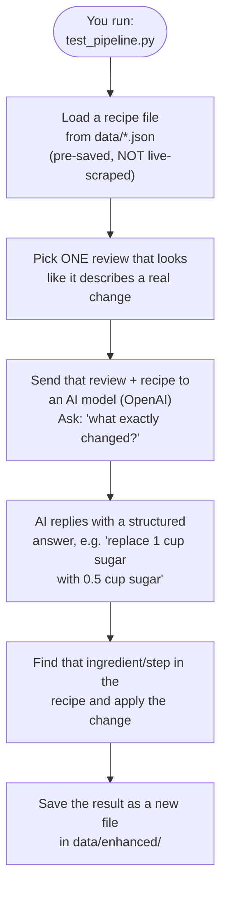

# Project Summary (Plain-Language Guide)

This doc is for anyone new to the project, technical or not. It answers two questions:

1. **What does each file do, and is it actually used when the project runs?**
2. **What actually happens, in order, when you run it — where does the data come from, and
   where do the results go?**

For the deeper technical write-up, see `docs/architecture.md`. For the "why does this project
exist" framing, see `docs/business-context.md`. For the list of things that are currently broken,
see `docs/tasks.md`.

## What this project does, in one paragraph

It takes a recipe and its reader reviews (already saved as files — nothing is fetched from the
internet when you run it), finds a review where someone describes a specific change they made to
the recipe (like "I used less sugar" or "I added an extra egg"), asks an AI model to turn that
sentence into a precise, structured instruction, and then applies that instruction to the recipe
to produce an "enhanced" version — plus a record of exactly what changed and which review it came
from.

## How you actually run it

```bash
cd src
uv run python test_pipeline.py single   # try it on one recipe
uv run python test_pipeline.py all      # try it on every recipe in data/
```

`test_pipeline.py` is the file you run. Everything else gets pulled in automatically from there.

## The flow, step by step



In plain terms:

1. **You run `test_pipeline.py`** (either `single` for one recipe, or `all` for every recipe file
   found in `data/`).
2. **It loads a recipe file** — e.g. `data/recipe_10813_best-chocolate-chip-cookies.json`. This
   file already contains the recipe *and* a list of reader reviews. **This data is static** — it
   was scraped from AllRecipes.com once, ahead of time, by a separate script (`scraper_v2.py`),
   and saved to disk. Running the pipeline does **not** go fetch anything from the internet; it
   only reads these already-saved files. Think of it like reading from a saved spreadsheet, not
   checking a live website.
3. **It picks one review** out of the ones flagged as "this review describes a change" (that
   flagging also happened ahead of time, during scraping).
4. **It asks an AI model** (OpenAI's `gpt-3.5-turbo`) to read that review plus the original recipe,
   and translate the review's sentence into a precise, computer-readable instruction — e.g. "find
   the line `1 cup white sugar` and replace it with `0.5 cup white sugar`."
5. **It applies that instruction** to a copy of the recipe — finding the matching ingredient or
   step and editing it.
6. **It saves the result** as a new file in `data/enhanced/` — the enhanced recipe, plus a record
   of what changed, why (the AI's stated reasoning), and which review it came from.

**Important caveat** (explained fully in `docs/tasks.md`): step 3 currently only ever picks *one*
review per recipe, even when several reviews describe changes — so most of the useful community
feedback in `data/` is currently being ignored on any given run. This summary describes what the
code *does*, not a claim that it does it well or completely.

## File-by-file reference

"Used?" means: is this file actually touched when you run `test_pipeline.py`? A "No" doesn't mean
the file is useless — it might be a one-time setup tool, a document, or a config file that's
still important, just not part of the live run.

### The files you run

| File | Used? | What it is, in plain terms |
|---|---|---|
| `src/test_pipeline.py` | **Yes — this is the starting point** | The script you actually run. Loads a recipe, calls the pipeline, prints what happened. |
| `src/scraper_v2.py` | **No, not during a pipeline run** | A separate tool that visits an AllRecipes.com page and saves the recipe + reviews as a `data/recipe_*.json` file. This is how the sample data in `data/` was originally created. You'd only run this yourself if you wanted to add a new recipe; the pipeline never calls it automatically. |

### The pipeline itself (`src/llm_pipeline/`)

| File | Used? | What it is, in plain terms |
|---|---|---|
| `pipeline.py` | **Yes** | The "conductor" — calls the other three pipeline files in order (extract → apply → generate) and saves the final result. |
| `tweak_extractor.py` | **Yes** | Step 1. Picks a review and asks the AI model to turn it into a structured instruction. |
| `recipe_modifier.py` | **Yes, partially** | Step 2. Applies the AI's instruction to the recipe. Two of its functions (`validate_modification_safety`, `apply_modifications_batch`) are written but never actually called by anything — extra capability sitting unused, see `docs/architecture.md`. |
| `enhanced_recipe_generator.py` | **Yes, partially** | Step 3. Packages the final result and saves it to a file. One of its functions (`generate_comparison_data`, meant for a future side-by-side comparison view) is written but never called. |
| `models.py` | **Yes** | Defines the "shapes" of the data (what fields a recipe, a review, or a change record must have). Doesn't *do* anything itself — every other file relies on these shapes to stay consistent. |
| `prompts.py` | **Yes, partially** | The exact wording sent to the AI model. Contains two versions: a simple one (`build_simple_prompt`, actively used) and a more detailed one with worked examples (`build_few_shot_prompt`, written but never used — see `docs/tasks.md` item 6). |
| `__init__.py` | **Yes** | Standard Python file that lets the other files be imported as a package. No logic of its own. |

### The data (`data/`)

| File/folder | Used? | What it is, in plain terms |
|---|---|---|
| `data/recipe_*.json` (6 files) | **Yes — this is the input** | Pre-saved recipes + reviews, one file per recipe. This is what the pipeline reads. Not live data. |
| `data/enhanced/*.json` (2 files) | **Not generated by current code as-is** | Example output files. These were checked into the repo already, but they show *more* than the current code can actually produce (2 changes per recipe and a "confidence score" field that doesn't exist in the code today). Treat these as an aspirational example of the end goal, not as proof of what running the pipeline right now gives you. See `docs/architecture.md`. |

### Configuration and setup (root folder)

| File | Used? | What it is, in plain terms |
|---|---|---|
| `pyproject.toml` | **Yes** | Lists which external libraries the project needs (like a shopping list) and the Python version required. |
| `uv.lock` | **Yes, indirectly** | Pins the *exact* version of every library, so everyone installing the project gets identical versions. You don't edit this by hand. |
| `.python-version` | **Yes, indirectly** | Tells the `uv` tool which Python version to use (3.13). |
| `.env` | **Yes** | Holds your private OpenAI API key. Required for step 4 (talking to the AI model) to work at all. Never committed to git. |
| `.gitignore` | No (not part of the pipeline) | Tells git which files/folders to never track (e.g. temporary files, secrets, caches). |

### Documentation (`docs/` and root)

None of these are code — they don't run or affect pipeline behavior. They're all "Used? No" in
the sense of execution, but they're what you should read before changing anything.

| File | What it's for |
|---|---|
| `CLAUDE.md` (root) | Project orientation for anyone (human or AI assistant) starting work here — what this is, known gotchas, links to the rest of `docs/`. |
| `docs/business-context.md` | Why this project exists, who it's for, what "done" is supposed to look like. |
| `docs/architecture.md` | The technical deep-dive: how each piece works, and every place the current code falls short of what it's supposed to do. |
| `docs/tasks.md` | A ranked list of known problems, each with evidence, in priority order. |
| `docs/summary.md` | This file. |
| `README.md` (root) | Install/setup instructions. |
| `docs/conventional-commits.md`, `docs/pull_request_template.md` | Generic git/GitHub workflow conventions — not specific to this project's logic. |
| `docs/react_optimizor.md` | Leftover from an unrelated template; this project has no frontend/React code. Safe to ignore. |

## Where the results actually go

If you follow the README exactly (`cd src` first, then run), results are saved to
`src/data/enhanced/` — **not** the top-level `data/enhanced/` folder this document and the other
docs refer to. That's a known bug (a folder path that should be fixed but isn't), documented in
`docs/tasks.md` item 7. If you're looking for output and can't find it in `data/enhanced/`, check
`src/data/enhanced/` instead.
